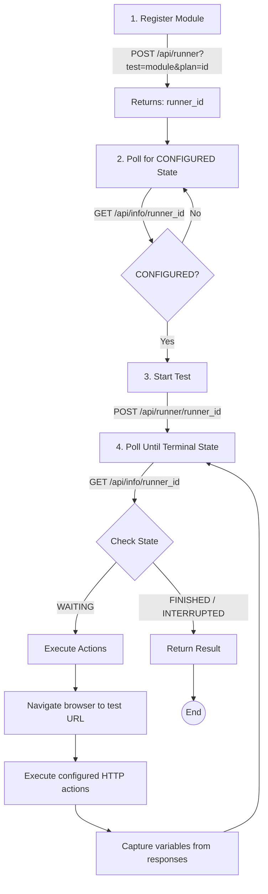

# oidc-autopilot

[](https://github.com/jrogeriosilva/oidc-autopilot)
[](https://github.com/jrogeriosilva/oidc-autopilot)
[](./LICENSE)
[](https://nodejs.org/)


**oidc-autopilot** automates [OpenID Connect Conformance Suite](https://www.certification.openid.net) tests using JSON configuration with dynamic actions and variable capture. Designed to streamline certification testing workflows for OpenID Connect implementations.

## Table of Contents

- [Features](#features)
- [Requirements](#requirements)
- [Installation](#installation)
- [Quick Start](#quick-start)
- [Configuration](#configuration)
  - [Configuration File Structure](#configuration-file-structure)
  - [Variable Capture](#variable-capture)
  - [Templating](#templating)
  - [Actions](#actions)
- [CLI Usage](#cli-usage)
  - [Options](#options)
  - [Environment Variables](#environment-variables)
- [Execution Flow](#execution-flow)
- [Development](#development)
- [Troubleshooting](#troubleshooting)
- [Contributing](#contributing)
- [License](#license)

## Features

| Feature | Description |
|---------|-------------|
| **Automated Test Execution** | Sequentially execute multiple OpenID conformance test modules |
| **Dynamic Variable Capture** | Automatically extract variables from API responses, URLs, and redirects |
| **Template Interpolation** | Use `{{variable}}` placeholders in endpoints, payloads, and headers |
| **Browser Automation** | Handle OAuth/OIDC flows automatically using Playwright |
| **Custom Actions** | Execute HTTP requests when tests enter WAITING state |
| **Status Polling** | Configurable polling intervals and timeouts |
| **Detailed Logging** | Comprehensive execution logs and test result summaries |

## Requirements

- **Node.js** 18 or higher
- **npm** or **yarn**
- Playwright-supported browsers

## Installation

1. Clone the repository:

```bash
git clone https://github.com/jrogeriosilva/oidc-autopilot.git
cd oidc-autopilot
```

2. Install dependencies:

```bash
npm install
```

3. Install Playwright browsers:

```bash
npx playwright install --with-deps
```

4. Build the project:

```bash
npm run build
```

## Quick Start

1. Copy the environment example file and configure your credentials:

```bash
cp env.example .env
# Edit .env with your CONFORMANCE_TOKEN
```

2. Create a configuration file (e.g., `config.json`):

```json
{
  "capture_vars": ["consent_id", "redirect_to"],
  "actions": [
    {
      "name": "approve_consent",
      "type": "api",
      "endpoint": "https://your-bank-api.com/consent/{{consent_id}}/approve",
      "method": "POST"
    }
  ],
  "modules": [
    {
      "name": "fapi1-advanced-final-ensure-request-object-signature-algorithm-is-valid",
      "actions": ["approve_consent"]
    }
  ]
}
```

3. Run the CLI:

```bash
node dist/index.js --config ./config.json --plan-id <YOUR_PLAN_ID>
```

## Configuration

### Configuration File Structure

The CLI expects a JSON configuration file with the following structure:

```json
{
  "capture_vars": ["var1", "var2", "..."],
  "actions": [
    {
      "name": "action_name",
      "type": "api",
      "endpoint": "https://api.example.com/{{var1}}/path",
      "method": "POST",
      "payload": { "key": "{{var2}}" },
      "headers": { "Authorization": "Bearer {{token}}" }
    }
  ],
  "modules": [
    {
      "name": "conformance-test-module-name",
      "actions": ["action_name"]
    }
  ]
}
```

### Variable Capture

The `capture_vars` array defines which variables to automatically extract during test execution. Variables are captured from:

- **API Response Bodies**: JSON fields matching variable names
- **URL Query Parameters**: Parameters in redirect URLs
- **Response Headers**: Header values during HTTP exchanges

Example:
```json
{
  "capture_vars": ["access_token", "session_id", "consent_id", "redirect_to"]
}
```

### Templating

Use `{{variable_name}}` syntax to reference captured variables anywhere in your configuration:

```json
{
  "endpoint": "https://api.example.com/consent/{{consent_id}}/approve",
  "headers": {
    "Authorization": "Bearer {{access_token}}"
  },
  "payload": {
    "session": "{{session_id}}"
  }
}
```

Variables are interpolated at runtime with the values captured during execution.

### Variables

Variables can be defined at two levels to provide fixed values for templating:

1. **Global variables**: Available to all modules
2. **Module variables**: Available to specific module (overrides global)

Variable precedence (highest to lowest):
- **Captured variables** (from API responses, URLs)
- **Module variables** (from config)
- **Global variables** (from config)

Example:
```json
{
  "variables": {
    "api_base": "https://api.example.com",
    "timeout": "5000"
  },
  "modules": [
    {
      "name": "test-module",
      "variables": {
        "timeout": "10000"
      }
    }
  ]
}
```

### Actions

Actions are typed operations executed when a test module enters the `WAITING` state. There are two types: **API** (HTTP) and **Browser** (Playwright).

#### API Actions

Execute HTTP requests and capture variables from responses:

| Field | Type | Required | Description |
|-------|------|----------|-------------|
| `type` | string | Yes | Must be `"api"` |
| `name` | string | Yes | Unique identifier for the action |
| `endpoint` | string | Yes | URL to send the request (supports templating) |
| `method` | string | Yes | HTTP method (`GET`, `POST`, etc.) Default: `"POST"` |
| `payload` | object | No | Request body (supports templating) |
| `headers` | object | No | Custom headers (supports templating) |

Example:
```json
{
  "name": "approve_consent",
  "type": "api",
  "endpoint": "https://api.example.com/consent/{{consent_id}}",
  "method": "POST",
  "payload": {
    "status": "approved"
  },
  "headers": {
    "Authorization": "Bearer {{token}}"
  }
}
```

#### Browser Actions

Execute browser operations using Playwright:

| Field | Type | Required | Description |
|-------|------|----------|-------------|
| `type` | string | Yes | Must be `"browser"` |
| `name` | string | Yes | Unique identifier for the action |
| `operation` | string | Yes | Browser operation (currently only `"navigate"`) |
| `url` | string | Yes | URL to navigate to (supports templating) |
| `wait_for` | string | No | Wait strategy: `"networkidle"` (default), `"domcontentloaded"`, or `"load"` |

Example:
```json
{
  "name": "navigate_callback",
  "type": "browser",
  "operation": "navigate",
  "url": "{{redirect_url}}",
  "wait_for": "networkidle"
}
```

**Note:** Browser actions within a module share the same browser session, preserving cookies and state.

## CLI Usage

```bash
node dist/index.js --config <path> [options]
```

### Options

| Option | Required | Default | Description |
|--------|----------|---------|-------------|
| `--config <path>` | Yes | - | Path to configuration JSON file |
| `--plan-id <id>` | Yes* | `CONFORMANCE_PLAN_ID` env | OpenID conformance test plan ID |
| `--token <token>` | Yes* | `CONFORMANCE_TOKEN` env | Bearer token for API authentication |
| `--base-url <url>` | No | `https://www.certification.openid.net` | Conformance server base URL |
| `--poll-interval <sec>` | No | `5` | Seconds between status checks |
| `--timeout <sec>` | No | `240` | Maximum seconds to wait for test completion |
| `--no-headless` | No | `false` | Show browser window during execution |

*Required if not set via environment variable

### Environment Variables

Create a `.env` file in the project root (see `env.example`):

| Variable | Required | Description |
|----------|----------|-------------|
| `CONFORMANCE_TOKEN` | Yes | Bearer token for OpenID Conformance API authentication |
| `CONFORMANCE_SERVER` | No | Custom conformance server URL |
| `CONFORMANCE_PLAN_ID` | No | Default plan ID (overridden by `--plan-id`) |

## Execution Flow

The CLI follows this execution flow for each test module:



**State Definitions:**

| State | Description |
|-------|-------------|
| `CREATED` | Module registered, waiting for configuration |
| `CONFIGURED` | Ready to start execution |
| `RUNNING` | Test in progress |
| `WAITING` | Test paused, waiting for external interaction |
| `FINISHED` | Test completed successfully |
| `INTERRUPTED` | Test stopped due to error or timeout |

## Development

### Available Scripts

```bash
# Development mode with hot reload
npm run dev -- --config ./config.json --plan-id <ID> --token <TOKEN>

# Build for production
npm run build

# Run tests
npm test

# Start built application
npm start -- --config ./config.json --plan-id <ID>
```

### Project Structure

```
src/
├── index.ts              # Entry point
├── cli.ts                # CLI argument parsing
├── config/
│   ├── loadConfig.ts     # Configuration loader
│   └── schema.ts         # Zod validation schemas
├── core/
│   ├── runner.ts         # Main execution orchestrator
│   ├── runnerHelpers.ts  # State polling & action handling
│   ├── conformanceApi.ts # OpenID Conformance API client
│   ├── httpClient.ts     # HTTP client with variable capture
│   ├── actions.ts        # Action execution logic
│   ├── capture.ts        # Variable extraction
│   ├── template.ts       # Template interpolation
│   ├── playwrightRunner.ts # Browser automation
│   └── logger.ts         # Logging utilities
└── utils/
    └── sleep.ts          # Async sleep utility
```

## Troubleshooting

### Common Issues

**Browser fails to launch**
```bash
# Reinstall Playwright browsers
npx playwright install --with-deps
```

**Authentication errors**
- Verify your `CONFORMANCE_TOKEN` is valid and not expired
- Check that the token has the required permissions for the test plan

**Tests timing out**
- Increase `--timeout` value for longer-running tests
- Check network connectivity to the conformance server
- Verify the test module name is correct

**Variable capture not working**
- Ensure variable names in `capture_vars` match exactly the field names in responses
- Check the CLI logs for captured values during execution

### Debug Mode

Run with visible browser to debug automation issues:

**Visible browser debugging**
```bash
node dist/index.js --config ./config.json --plan-id <ID> --no-headless
```

## Contributing

Contributions are welcome! Please feel free to submit a Pull Request.

1. Fork the repository
2. Create your feature branch (`git checkout -b feature/amazing-feature`)
3. Commit your changes (`git commit -m 'Add some amazing feature'`)
4. Push to the branch (`git push origin feature/amazing-feature`)
5. Open a Pull Request

## License

This project is licensed under the MIT License - see the [LICENSE](LICENSE) file for details.

---

Built with TypeScript, Playwright, and Zod.
